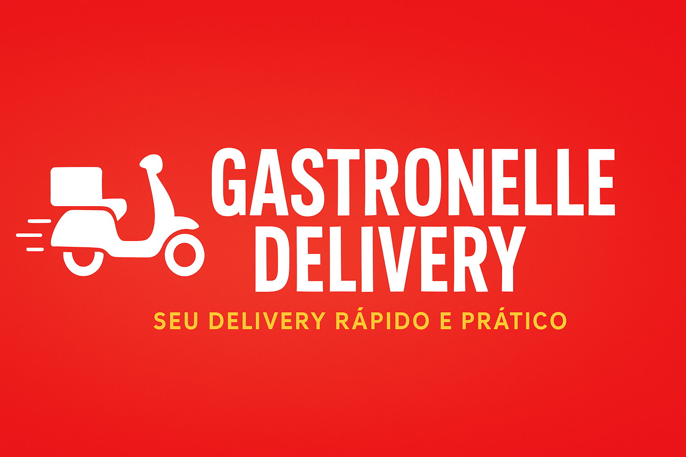

<p align="center">
  
</p>

# 🍽️ Gastronelle-Delivery

Delivery rápido e prático de alimentos — projeto frontend estático com páginas como **início, pedidos, mercado, restaurantes, login e contato**.  

---

## 📑 Table of Contents
1. [Sobre](#sobre)
2. [Funcionalidades](#funcionalidades)
3. [Tecnologias](#tecnologias)
4. [Como Executar](#como-executar)
5. [Estrutura de Pastas](#estrutura-de-pastas)
6. [Demonstração](#demonstração)

---

## 📌 Sobre

O **Gastronelle-Delivery** é um site para delivery de alimentos, feito em **HTML, CSS e JavaScript**, com várias páginas interligadas para simular a experiência de um aplicativo de delivery.  

---

## 🚀 Funcionalidades

- Layout responsivo  
- Navegação entre páginas (home, mercado, pedidos, restaurante, quem somos, contato)  
- Formulário de login  
- Organização visual inspirada em apps de delivery  

---

## 🛠️ Tecnologias


---

## ▶️ Como Executar

```bash
# Clone o repositório
git clone https://github.com/pedrinngkl/Gastronelle-Delivery.git

# Entre na pasta
cd Gastronelle-Delivery

# Abra o arquivo index.html no navegador
```
---
## 📂 Estrutura de Pastas
Gastronelle-Delivery/
│
├── assets/                # Imagens, ícones, logos etc
│
├── css/
│   └── style.css          # Estilos globais
│
├── script.js              # Funções JS de interação
│
├── index.html             # Página principal
├── login.html             # Login
├── mercado.html           # Página do mercado
├── pedidos.html           # Pedidos
├── restaurante.html       # Página de restaurantes
├── quem-somos.html        # Quem somos
├── contato.html           # Contato

---
## 🌐 Demostração
https://pedrinngkl.github.io/Gastronelle-Delivery/
---
<p align="center">
  <strong>Feito com ❤️ por Pedro</strong>
</p>

<p align="center">
  
</p>

